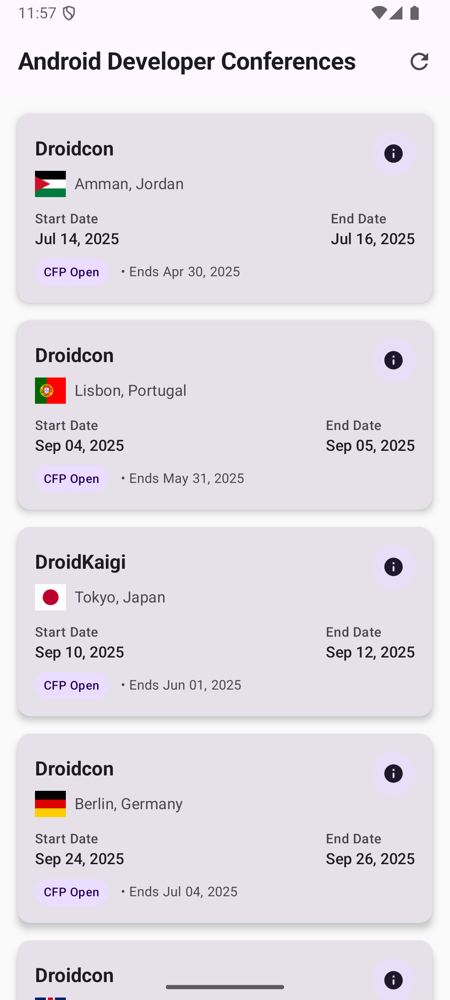
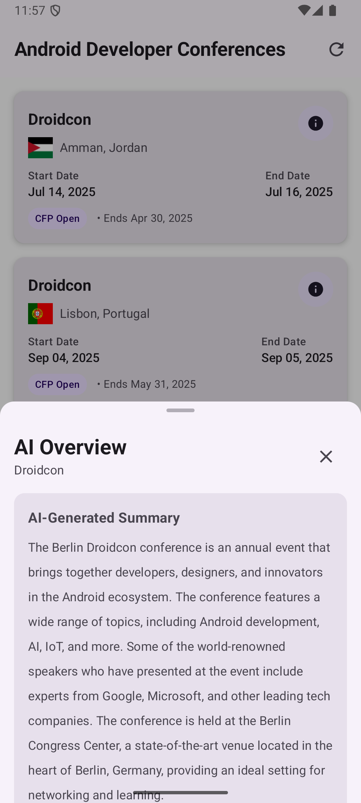
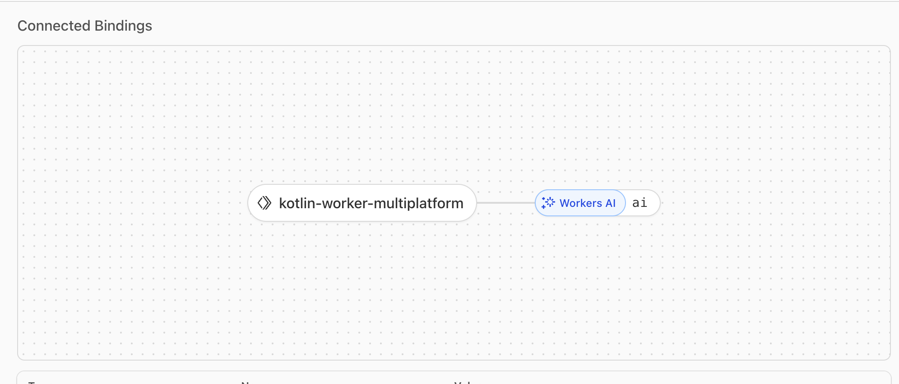

# KotlinWorker - KMP + Cloudflare Workers

A **Kotlin Multiplatform** project that explores **Cloudflare Workers** using **Kotlin/JS**, demonstrating how to share code between a Cloudflare Worker and an Android application.

## 🎯 What it achieves

This project showcases:

- **Cloudflare Workers with Kotlin/JS**: Deploy serverless functions written in Kotlin
- **Shared code between platforms**: Common data models and network logic shared between Worker and Android app  
- **Conference discovery app**: Displays upcoming Android developer conferences with AI-powered summaries
- **AI integration**: Uses Cloudflare AI Workers to generate conference overviews
- **Modern Android UI**: Material Design 3 with Jetpack Compose

## 🏗️ Project Structure

```
├── composeApp/           # Android app (Compose UI)
│   └── src/androidMain/
├── shared/               # Shared Kotlin code
│   ├── models/          # Data classes (ConferenceModel, AIRequest, etc.)
│   └── network/         # API services (ConferenceApiService)
├── worker/               # Cloudflare Worker (Kotlin/JS)
│   ├── src/jsMain/      # Worker logic and conference transformation
│   └── wrangler.toml    # Worker configuration
└── gradle/              # Dependencies and version catalogs
```

### Key Components

- **`shared/`**: Contains data models and network services used by both the Android app and the Cloudflare Worker
- **`worker/`**: Kotlin/JS code that runs on Cloudflare's edge, handling conference data transformation and AI summaries  
- **`composeApp/`**: Android app with Material Design 3 UI, displaying conferences with AI overview feature

## 🚀 Features

### Android App
- **Conference List**: Browse upcoming Android developer conferences
- **Conference Details**: View dates, locations, and Call for Papers information  
- **AI Overview**: Tap the info button on any conference card to get an AI-generated summary
- **Material Design 3**: Modern UI with bottom sheets, loading states, and error handling

### Cloudflare Worker
- **Conference Data**: Fetches and transforms conference data from external APIs
- **AI Integration**: Uses Cloudflare AI Workers (`@cf/meta/llama-3-8b-instruct`) to generate conference summaries
- **API Endpoints**:
  - `GET /` - Returns list of transformed conferences
  - `POST /` - Generates AI summary for a given conference URL

## 🛠️ Local Development Setup

### Prerequisites

- **Node.js** (v16+)
- **Java** (JDK 11+) 
- **Android Studio** (for Android development)
- **Cloudflare account** (for Workers deployment)

### 1. Clone and Setup

```bash
git clone <repository-url>
cd KotlinWorker
```

### 2. Configure Cloudflare Worker

Update `worker/wrangler.toml` with your Cloudflare account details:

```toml
name = "your-worker-name"
account_id = "your-cloudflare-account-id"  # Replace with your account ID
workers_dev = true
compatibility_date = "2025-08-06"

main = "worker.js"

[ai]
binding = "ai"

[observability]
enabled = true
```

### 3. Update API Base URL

In `shared/src/commonMain/kotlin/com/jitinsharma/worker/network/ConferenceApiService.kt`:

```kotlin
private val baseUrl = "https://your-worker-name.your-subdomain.workers.dev"
```

## 🏃‍♂️ Build and Deploy

### Build the Worker

```bash
cd worker
./gradlew build
```

### Deploy to Cloudflare Workers

```bash
cd worker

# Install Wrangler CLI (if not already installed)
npm install -g wrangler

# Login to Cloudflare
wrangler login

# Deploy the worker
wrangler deploy
```

### Build Android App

```bash
# Build the Android app
./gradlew :composeApp:assembleDebug

# Or run directly in Android Studio
```

## 📷 Screenshots

### Android App
<div align="center">
  
  
</div>

### Cloudflare Worker Configuration
<div align="center">
  
</div>

*Cloudflare Worker AI binding configuration in the dashboard*

## 📱 Usage

1. **Launch the Android app**
2. **Browse conferences** in the main list
3. **Tap conference cards** to open their websites  
4. **Tap the info button (ⓘ)** on any conference card
5. **View AI-generated summary** in the bottom sheet

## 🤖 API Examples

### Get Conferences
```bash
curl https://your-worker.workers.dev/
```

### Get AI Summary
```bash
curl -X POST https://your-worker.workers.dev/ \
  -H "Content-Type: application/json" \
  -d '{"url":"https://berlin.droidcon.com"}'
```
---